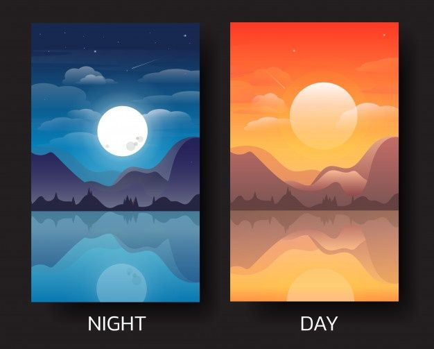
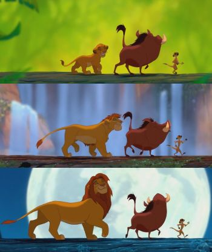
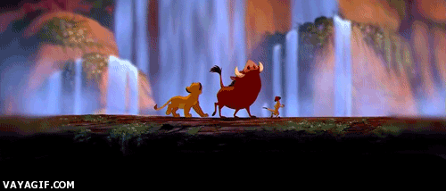
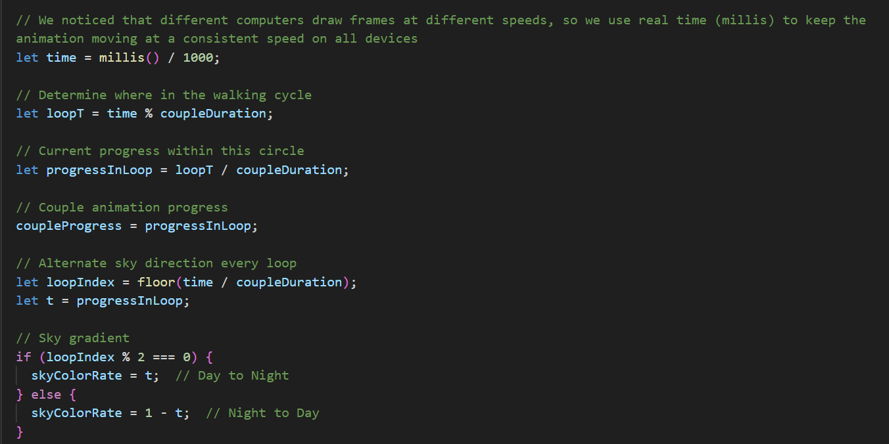
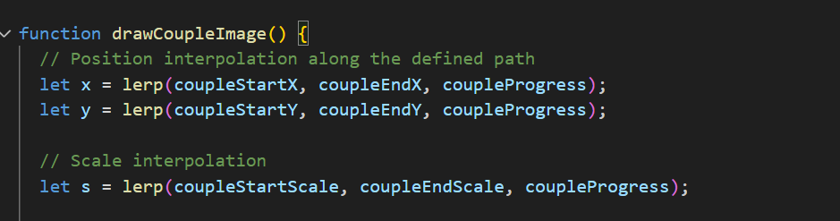
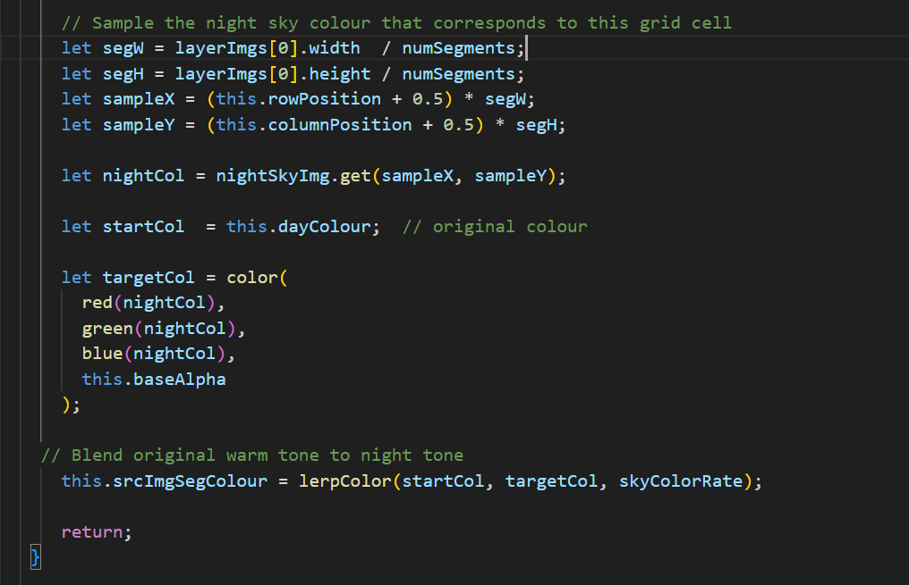
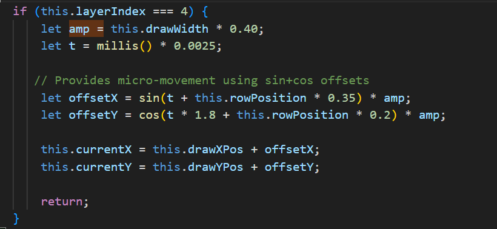

# yqia0751_9103_major_project

# Major Project

## Part 1: How to interact with the work

This project runs entirely through time-based animation.
The viewer does not need to click, move the mouse or interact with the sketch in any way.
Once the page loads, the animation begins automatically and repeats in a continuous loop.
The cycle lasts **18** seconds, during which the scene gradually changes over time:
1. The couple walks along the bridge
2. The sky transitions between warm dusk tones and deep nighttime blue
3. The main figure sways slightly

Note: A whole cycle lasts 36 seconds (18 seconds from day to night, 18 seconds from night to day), repeating indefinitely.

- **Couple Walking**

The couple moves from the background towards the foreground based on time. Upon reaching the end of their path, the animation resets and begins a new cycle.

- **Sky Transitions**

The sky layer is composed of line-based segments whose colours gradually shift from warm orange-red tones to deep night-blue hues. This transition reverses direction each cycle to simulate the alternation between day and night, creating a slow and rhythmic breathing effect.

- **Person screaming**

The main figure gently sway, creating a constant sense of unease and tension. This repetitive motion makes the character feel alive within the scene, as if caught in a continuous emotional tremor that never fully settles.

### Summary
The animation runs on its own over time. The sky slowly changes between day and night, the couple walks across the bridge, and the main figure keeps swaying gently. Every visual change follows the time cycle, so the viewer just watches the scene unfold without needing to do anything.

---

# Chosen Interaction Method: **Time**

# Part 2: Differences with Group Members

- **Time-Based Visual Effects** 

My group member uses audio to drive all visual changes, such as shaking intensity and character scaling. In contrast, my animation is entirely time-based. The scene progresses automatically through a fixed cycle without relying on sound input, and every visual effect follows a continuous timing loop.

- **Walking Couple Instead of Audio-Scaled Main Character** 

While my group member focuses on the main character and links its size and shaking strength to live audio volume, I animate a couple walking across the bridge. Their position and scale shift smoothly over time, creating the feeling that they are gradually moving closer to the viewer.

- **Sky Colour Transition** 

In my version, the sky transitions slowly between day and night tones in a repeating cycle, highlighting the passage of time. This colour shift is tied to the time loop rather than to changes in sound amplitude.

- **Subtle Main Character Motion** 

Instead of enlarging the main character according to audio volume, I keep the character in a gentle, continuous sway. This subtle movement better aligns with the emotional tone of the original artwork and maintains a quieter atmospheric presence in the scene.

---

# Part 3 : Inspiration

This image of day and night shows the transition from night to day and the changes in tones. It inspired me to incorporate a similar day-to-night effect in my work to convey the passage of time.

Another inspiration for my animation comes from the walking sequences in The Lion King, where the characters move steadily across the screen while the environment behind them changes dramatically. Although the characters themselves stay the same size, the shifting backgrounds create a strong sense of time passing and emotional progression. This idea closely relates to my couple animation: the couple walks forward at a steady pace, the changing sky conveys the passage of time. The effect is less about physical movement and more about showing a journey through changing moments.

---

# Part 4: Technical Explanation of Individual Code

- **Functionality**:  
  This part of the code uses `millis()` to run the entire scene on a fixed time cycle. Every 18 seconds the animation resets and begins a new loop. During each loop, `progressInLoop` moves from 0 to 1, and every animated element in the scene uses this shared value. This allows the whole scene to move at a steady speed that is not affected by different frame rates on different computers.

- **Technical Highlight**:  
  By relying on real-time values instead of frame counts, the animation avoids running too fast or too slow on different machines. This makes the timing consistent and gives the scene a smooth, continuous rhythm.

- **Functionality**:  
  The couple walks along the bridge from the distance toward the viewer. Their position gradually shifts from the starting point to the ending point, and their scale increases from 0.6 to 1.8. This creates the feeling that they are slowly approaching the viewer. The movement feels even because everything is driven by the same progress value.

- **Technical Highlight**:  
  `lerp()` uses `coupleProgress` to smoothly transition between the start and end values, so the couple never jumps or snaps. The three interpolations control X position, Y position and scale, allowing the walk cycle to maintain a consistent direction and pacing.

- **Functionality**:  
  Each sky segment gradually shifts from its original warm orange tone to deep night blue. The colour changes stay synchronised with the couple’s time cycle, forming a repeating day to night loop.

- **Technical Highlight**:  
  Every sky line samples the matching pixel from nightSkyImg and blends it with the original colour using `lerpColor()` and `skyColorRate`. The transition is time-driven, producing a smooth, layered gradient rather than a flat colour shift.

- **Functionality**:  
  The main character has a constant, gentle shake both horizontally and vertically. This adds a sense of instability and emotional tension that fits the atmosphere of the original artwork.

- **Technical Highlight**:  
  The shaking comes from adding small, time-based offsets using `sin()` and `cos()`. The frequency and intensity are influenced by the global time `t` as well as each segment’s `rowPosition`, making it feel more organic.

---

# Technical References

To achieve specific effects in my project, I referred to the **p5.js** library and its documentation. Below are the technical references and their applications:

- **lerpColor() – Gradient Transitions**:  
  [p5.js Documentation: lerpColor](https://p5js.org/reference/p5/lerpColor/)

- **lerp() – Smooth transition of the couple's position and size**:  
  [p5.js Documentation: lerp](https://p5js.org/reference/p5/lerp/)

- **millis() – Time-based animation control**:  
  [p5.js Documentation: millis](https://p5js.org/reference/p5/millis/)